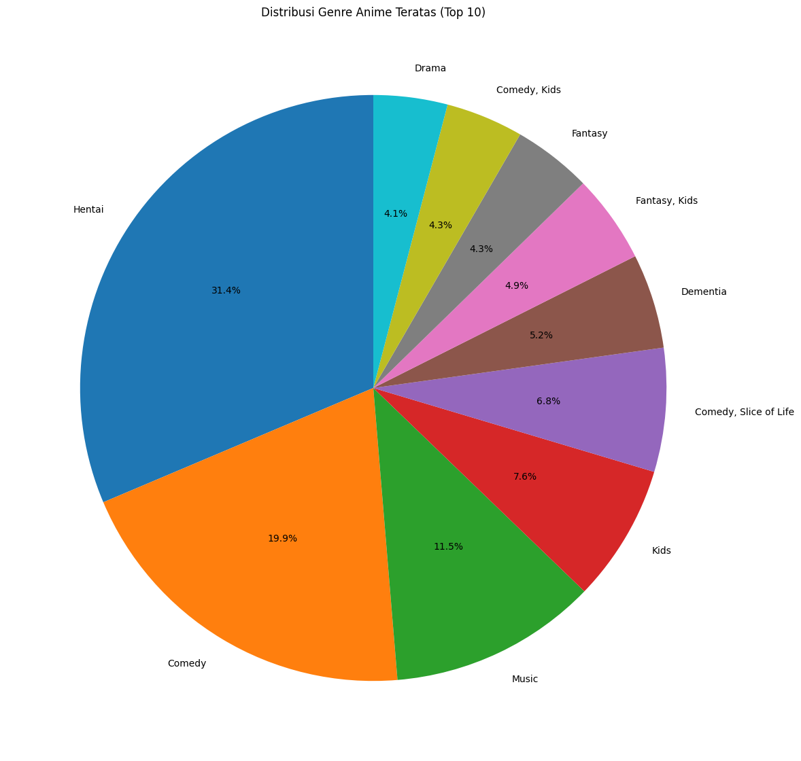
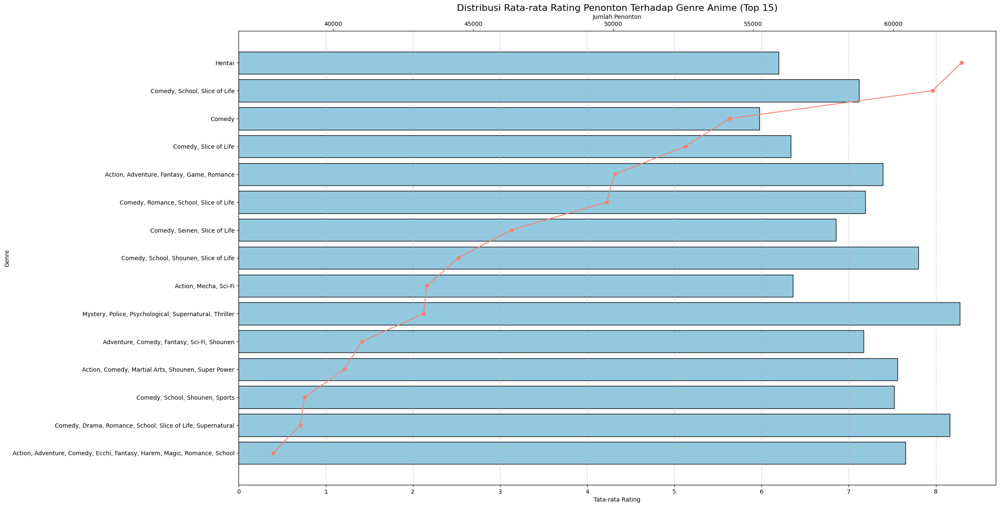
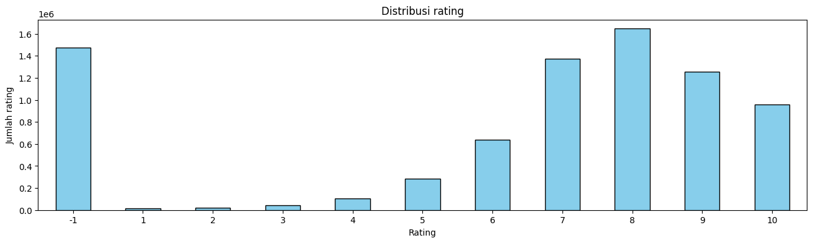
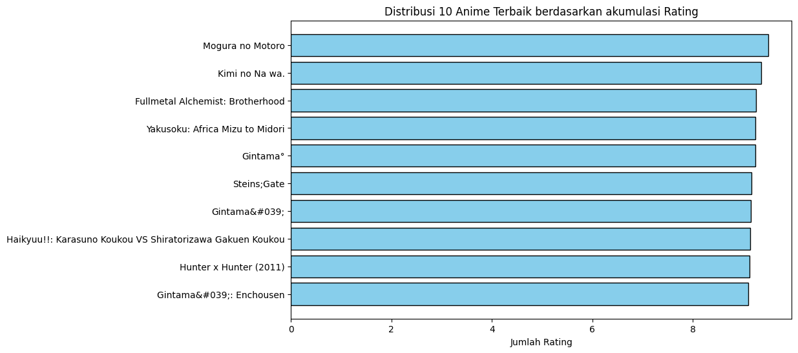
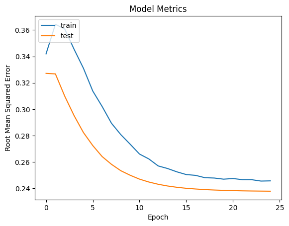

# Laporan Proyek Machine Learning - Masdarul Rizqi
## Latar Belakang
Industri anime di seluruh dunia, termasuk di Indonesia, juga mengalami pertumbuhan pesat dalam beberapa tahun terakhir. Jumlah penggemar anime terus meningkat, mencapai lebih dari 120 juta pengguna hanya di Crunchyroll pada tahun 2021 dan produksi anime baik dari Jepang maupun negara lain mencapai angka ribuan judul anime yang telah tayang di berbagai platform. Sementara itu hingga Oktober 2021, MyAnimeList memiliki kira-kira 17.000 judul anime dan 2,5 juta karakter di basis data tersebut. MyAnimeList juga memiliki 83 juta pengguna terdaftar. Pertumbuhan ini menciptakan peluang besar namun juga menimbulkan tantangan baru, terutama bagi calon penonton.

Salah satu tantangan yang dihadapi oleh penonton anime adalah menemukan sumber yang tepat untuk menonton anime favorit mereka. Ada banyak situs web yang menawarkan konten anime, baik yang legal maupun ilegal, dengan kualitas dan fitur yang berbeda-beda. Beberapa situs web yang populer di antara penggemar anime adalah:
*   Crunchyroll [[1]](https://www.grandviewresearch.com/industry-analysis/anime-market) : Situs web streaming anime legal yang memiliki lebih dari 1.200 judul anime dan 30.000 episode. Crunchyroll juga menyediakan manga, drama, musik, dan berita terkait anime. Crunchyroll memiliki layanan berlangganan yang memberikan akses tanpa batas dan tanpa iklan ke seluruh konten mereka. Crunchyroll juga mendukung subtitle dalam berbagai bahasa, termasuk Bahasa Indonesia.
*   Funimation [[2]](https://marketsplash.com/anime-statistics/) : Situs web streaming anime legal yang memiliki lebih dari 600 judul anime dan 10.000 episode. Funimation juga menyediakan Anime, game, merchandise, dan podcast terkait anime. Funimation memiliki layanan berlangganan yang memberikan akses tanpa batas dan tanpa iklan ke seluruh konten mereka. Funimation juga mendukung dubbing dalam bahasa Inggris dan subtitle dalam berbagai bahasa.
* 9Anime [[3]](https://comicbook.com/anime/news/anime-industry-2021-2022-growth-report/) : Situs web streaming anime ilegal yang memiliki lebih dari 10.000 judul anime dan 100.000 episode. 9Anime menyediakan konten anime secara gratis dan tanpa iklan. 9Anime juga mendukung subtitle dalam berbagai bahasa, termasuk Bahasa Indonesia. Namun, 9Anime tidak memiliki lisensi resmi dari pemilik hak cipta anime dan seringkali mengalami masalah dengan domain dan server mereka.

Selain situs web, ada juga aplikasi yang dapat digunakan untuk menonton anime, seperti Fire Anime, VRV, Hulu, Tubi, IQIYI International, Netflix, HIDIVE, HBO Max, dan RetroCrush. Aplikasi ini memiliki kelebihan dan kekurangan masing-masing, tergantung pada ketersediaan judul, kualitas video, fitur interaktif, harga, dan lain-lain.
## Business Understanding
Berdasarkan latar belakang yang sudah dipaparkan sebelumnya, berikut rincian masalah yang dapat diselesaikan dalam proyek ini :
### Problem Statements
Menjelaskan pernyataan masalah latar belakang:
*   Bagaimana memahami karakteristik dan distribusi data pada dataset anime dan penilaian penggemar? 
*   Bagaimana meningkatkan pengalaman penggemar dalam menemukan anime yang sesuai dengan minat penggemar? 
*   Bagaimana memberikan rekomendasi anime yang relevan berdasarkan preferensi penggemar?
### Goals
Menjelaskan tujuan dari pernyataan masalah:
*   Menampilkan chart untuk distribusi genre anime untuk menyoroti genre anime yang paling populer, distribusi skor serta menampilkan anime terbaik dan terpopuler berdasarkan skor penggemar.
*    Membuat sistem rekomendasi anime yang dapat memberikan rekomendasi anime berdasarkan selera penggemar. 
*   Memanfaatkan data skor anime dari penggemar untuk memberikan rekomendasi anime berdasarkan perilaku penggemar.
### Solution statements
1.  **Visualisasi Karakteristik Data:**
    *   Mengumpulkan data distribusi genre Anime dari dataset.
    *   Melakukan analisis statistik untuk menentukan distribusi rating penonton.
    *   Menentukan kriteria untuk Anime terbaik berdasarkan rating penonton.
    *   Menentukan kriteria untuk Anime terpopuler berdasarkan jumlah penonton.
    *   Menggunakan teknik visualisasi data untuk mempresentasikan distribusi genre Anime, rating, serta menampilkan Anime terbaik dan terpopuler secara jelas dan intuitif.
2.  **Menggunakan pendekatan Content-based Filtering untuk memberikan rekomendasi Anime berdasarkan selera penonton (genre).**
    *   Menggunakan pendekatan `TF-IDF` untuk mengonversi `genre` menjadi representasi numerik.
    *   Mengubah matrix menjadi dense meggunakan pendekatan `todense()`
    *   Menghitung derajat kesamaan kosinus antar Anime berdasarkan representasi numerik.
    *   Memberikan rekomendasi Anime berdasarkan kesamaan genre.
3.  **Menggunakan pendekatan Collaborative Filtering untuk memberikan rekomendasi Anime berdasarkan perilaku penonton.**
    *   Melakukan encoding pada atribut `user_id` dan `anime_id`.
    *   Membangun model `RecommenderNet` menggunakan TensorFlow dan Keras.
    *   Melakukan pembagian data untuk data training dan data validation
    *   Melakukan training model dengan data training.
    *   Memberikan rekomendasi Anime yang personal untuk penonton berdasarkan perilaku penonton.
## Data Understanding
Dataset yang digunakan dalam proyek ini adalah [Anime Recommendations Database](https://www.kaggle.com/datasets/CooperUnion/anime-recommendations-database) yang diambil dari platform kaggle.com yang dipublikasikan oleh COOPERUNION. Meskipun dataset ini awalnya dikumpulkan untuk merekomendasikan anime.
Atribut dataframe dapat dilihat pada Tabel 1 dan Tabel 2.

Tabel 1. Atribut pada data Anime.csv
|   Column   | Keterangan |  Dtype  |
|------------|----------------|---------|
| anime_id   |    merepresentasikan Id unik untuk setiap anime       | int64   |
| name       |      merepresentasikan Judul  untuk setiap anime    | object  |
| genre      |    merepresentasikan genre untuk setiap Anime       | object  |
| type       |    merepresentasikan Type untuk setiap Anime       | object  |
| episodes   |    merepresentasikan jumlah episode untuk setiap Anim       | object  |

Tabel 2. Atribut pada data rating.csv
Atribut | Keterangan | Tipe Data
--- | ------  |  -----
 user_id | merepresentasikan Id unik untuk setiap penonton| int64
 anime_id |merepresentasikan Id unik untuk setiap anime | int64
 rating | merepresentasikan penilaian yang diberikan oleh penonton | int64

Pada data rating.csv berisikan informasi sebanyak 105339 baris dan 3 kolom data.
### Visualisasi Data
1.  Distribusi Genre Anime: 
    *  Analisis data genre anime menunjukkan variasi yang menarik dalam preferensi penonton. Genre Hentai memimpin dengan jumlah anime terbanyak 823, diikuti oleh Comedy  dengan 523 anime, oleh Music 301  anime, Oleh Kids 199 Anime.  Ini menandakan bahwa anime dengan campuran elemen dramatis, komedi, dan unsur romantis mendapat perhatian yang signifikan. Di sisi lain, anime dengan kombinasi Action|Adventure|Children|Comedy|Mystery atau Adventure|Drama|Romance|Thriller|War hanya muncul satu kali. Meskipun jarang, keberagaman ini mencerminkan bahwa ada eksperimen dan inovasi dalam menciptakan anime dengan gabungan genre yang lebih kompleks dan bervariasi Penting untuk mencatat bahwa anime dengan genre yang jarang mungkin memiliki audiens yang lebih terbatas, namun dapat memberikan pengalaman yang unik dan menarik bagi penonton yang menyukai kombinasi genre tersebut seperti yang ditunjukkan pada Gambar 1.  
    Gambar 1. Distribusi persebaran genre Anime
    *  Meskipun Mystery, Police, Psychological, Supernatural, dan Thriller mencapai rating tertinggi sebesar 8.5, sedangkan Comedy, Drama, Romance, Slice of Life, dan Supernatural mencapai 8.2, serta Comedy, School, Shounen, dan Slice of Life mencapai 7.85, dll. menonton seperti yang ditunjukkan pada Gambar 2. 
     
    Gambar 2. Distribusi rata-rata rating penonton terhadap genre anime
2.  Distribusi Rating Anime:
    *   Dari Gambar 3, terlihat bahwa mayoritas penilaian Anime cenderung tinggi, dengan lebih dari setengah total rating berada pada rentang 6 hingga 10, dan -1. 
     
    Gambar 3. Distribusi persebaran genre anime
3.  Anime Terbaik Berdasarkan Akumulasi Rating:
    *  Dari gambar 4 terlihat bahwa Anime "Mogura no motoro" Tertinggi rating, diikuti "Kimi No Nawa", dan diikuti 3 anime "Fullmental alcehimst: brotherhood","Yakusoku: Africa Mizu to midori","Gintama", dan anime lainnya.   
     
    Gambar 4. Distribusi persebaran genre Anime
4.  anime Terpopuler Berdasarkan Rating dan Jumlah penonton:
    *   Analisis data genre anime menunjukkan variasi yang menarik dalam preferensi penonton. Genre Hentai memimpin dengan jumlah anime terbanyak 823, diikuti oleh Comedy  dengan 523 anime, oleh Music 301  anime, Oleh Kids 199 Anime.  Ini menandakan bahwa anime dengan campuran elemen dramatis, komedi, dan unsur romantis mendapat perhatian yang signifikan. Di sisi lain, anime dengan kombinasi Action|Adventure|Children|Comedy|Mystery atau Adventure|Drama|Romance|Thriller|War hanya muncul satu kali. Meskipun jarang, keberagaman ini mencerminkan bahwa ada eksperimen dan inovasi dalam menciptakan anime dengan gabungan genre yang lebih kompleks dan bervariasi Penting untuk mencatat bahwa anime dengan genre yang jarang mungkin memiliki audiens yang lebih terbatas, namun dapat memberikan pengalaman yang unik dan menarik bagi penonton yang menyukai kombinasi genre tersebut seperti yang ditunjukkan pada Gambar 5 
     
    Gambar 5. Distribusi persebaran genre Anime
## Data Preparation
Pada tahap awal persiapan data, dilakukan penanganan terhadap duplikasi data pada dataset Anime (_Anime Dataset_). Penggunaan fungsi `duplicated()` dijustifikasi karena dapat dengan mudah mengidentifikasi duplikasi pada kolom _Name_, yang penting untuk memastikan keberlanjutan integritas dataset. Fungsi ini memberikan informasi yang diperlukan untuk melihat baris mana yang merupakan duplikat, sehingga dapat diambil tindakan selanjutnya. Selanjutnya, penggunaan `drop()` untuk menghapus baris dengan data ganda merupakan pilihan tepat untuk menjaga kebersihan dataset.

Selanjutnya, fokus diberikan pada penanganan nilai yang hilang pada dataset Anime. Pemilihan fungsi `isnull()` untuk mengidentifikasi jumlah nilai yang hilang pada setiap atribut didasarkan pada kebutuhan untuk mengetahui apakah ada kebutuhan untuk imputasi nilai atau penanganan khusus. Dalam konteks ini, dataset Anime tidak mengandung nilai yang hilang, dan ini memastikan keberlanjutan dan keutuhan data tanpa adanya pengaruh dari nilai yang hilang.

Proses berlanjut pada dataset _rating_ (_Rating Dataset_), di mana terlebih dahulu dilakukan pengecekan terhadap duplikasi data dengan fungsi `duplicated()`. Pemilihan fungsi ini disesuaikan dengan kebutuhan untuk mengidentifikasi data yang mungkin identik, sehingga hasil analisis dapat dapat diandalkan. Dalam kasus ini, tidak adanya duplikasi memvalidasi integritas dataset.

Terakhir, penanganan nilai yang hilang pada dataset _rating_ dilakukan menggunakan fungsi `isnull()`. Penggunaan fungsi ini disesuaikan dengan kebutuhan untuk melihat apakah dataset mengandung nilai yang hilang. Dalam konteks ini, dataset _rating_ juga tidak mengandung nilai yang hilang, mengindikasikan kualitas dan konsistensi data yang baik.
## Modeling & Result
Content-Based Filtering, dengan fokus pada karakteristik item, mengandalkan kualitas fitur untuk memberikan rekomendasi yang personal. Keunggulan terletak pada efektivitasnya pada data pengguna yang terbatas dan kemampuannya menangani Cold Start Problem. Namun, rentan terhadap "filter bubble" dan ketergantungan pada kualitas fitur yang digunakan.

Sementara itu, Collaborative Filtering, baik user-based maupun item-based, mengeksplorasi pola interaksi pengguna dan item. Meskipun efektif menangani Cold Start Problem dan menemukan pola kompleks, model ini dapat terpengaruh oleh data yang sparse dan kesulitan menangani perubahan preferensi seiring waktu.
### Pengembangan Model dengan Content Based Filtering
1. TF-IDF Vectorizer
  
    Pada tahap ini, digunakan TF-IDF Vectorizer untuk mengekstrak fitur dari kolom `genre` pada dataset Anime. Fungsi TfidfVectorizer() digunakan untuk mengonversi teks menjadi matriks TF-IDF, yang kemudian digunakan untuk mengukur sejauh mana suatu kata kunci (term) signifikan dalam suatu dokumen. Dalam hal ini, dokumen adalah deskripsi genre Anime. Representasi vektor ini dihitung menggunakan formula _TF-IDF_:

    Term Frequency (TF) adalah frekuensi suatu kata dalam dokumen. Rumusnya adalah:

    $$TF(t, d) = \frac{f_{t, d}}{\sum_{t' \in d} f_{t', d}}$$

    di mana:
    - $f_{t, d}$ adalah frekuensi kata $t$ dalam dokumen $d$
    - $\sum_{t' \in d} f_{t', d}$ adalah jumlah semua kata dalam dokumen $d$
    
    Inverse Document Frequency (IDF) adalah ukuran seberapa jarang suatu kata muncul di seluruh dokumen. Rumusnya adalah:

    $$IDF(t, D) = \log \frac{N}{|{d \in D : t \in d}|}$$

    di mana:
    - $N$ adalah jumlah total dokumen
    - $|{d \in D : t \in d}|$ adalah jumlah dokumen yang mengandung kata $t$
    
    TF-IDF kemudian dihitung dengan mengalikan TF dan IDF:

    $$TFIDF(t, d, D) = TF(t, d) \times IDF(t, D)$$
   

2.  Mengubah Matriks menjadi Dense

    Setelah mendapatkan matriks _TF-IDF_, kemudian mengubah matriks tersebut menjadi format _dense_ agar dapat diinterpretasikan dengan mudah. Proses ini dilakukan dengan menggunakan fungsi `todense()`.

3. Menghitung Derajat Kesamaan (Cosine Similarity)
    
    Langkah selanjutnya adalah menghitung derajat kesamaan antara Anime menggunakan metode _Cosine Similarity_.
    $$\text{Cosine Similarity}(A, B) = \frac{A \cdot B}{||A|| ||B||} = \frac{\sum_{i=1}^{n} A_i B_i}{\sqrt{\sum_{i=1}^{n} A_i^2} \sqrt{\sum_{i=1}^{n} B_i^2}}$$
    di mana:
    - $A . B$ adalah jumlah total dokumen
    - $||A||$ dan $||B||$ adalah jumlah dokumen yang mengandung kata $t$
4.  Hasil

    
    | anime_id |        name                                      | genre                                               | type    | episodes | rating | members |
    |----------|--------------------------------------------------|------------------------------------------------------|---------|----------|--------|---------|
    | 10752    | Wu Geng Ji                                       | Action, Fantasy, Historical, Martial Arts, Supernatural | ONA     | Unknown  | 7.18   | 121     |
    | 1973     | Haikara-san ga Tooru                             | Drama, Historical, Romance, Shoujo, Slice of Life       | TV      | 42       | 7.39   | 1155    |
    | 1871     | Ore no Nounai Sentakushi ga, Gakuen Love Comedy wo Zenryoku de Jama Shiteiru | Comedy, Romance, School                       | OVA     | 1        | 7.42   | 35583   |
    | 402      | Fullmetal Alchemist: Brotherhood Specials        | Adventure, Drama, Fantasy, Magic, Military, Shounen    | Special | 4        | 8.11   | 67962   |
    | 8990     | Issunboushi                                      | Drama                                              | Movie   | 1        | 6.00   | 120     |
### Pengembangan Model dengan Collaborative Filtering
1. Encoding Atribut user_id dan anime_id

    Pada tahap ini, dilakukan encoding untuk atribut `user_id` dan `anime_id` pada dataset _rating_ (_Rating Dataset_). Encoding ini dilakukan untuk mengubah nilai unik dari kedua atribut tersebut menjadi nilai numerik degan tujuan untuk meningkatkan efisiensi, mengurangi dimensi, memberikan identitas unik, dan meningkatkan kinerja model sistem rekomendasi.

2. Membagi Data untuk Pelatihan dan Validasi

    Dataset peringkat dibagi menjadi dua bagian, yaitu data pelatihan dan data validasi, menggunakan fungsi `train_test_split()` dari `scikit-learn`. Tujuan utama dari membagi dataset peringkat menjadi data _rating_ dan data validasi adalah untuk mempersiapkan data agar dapat digunakan dalam proses pelatihan dan evaluasi model.

3. Proses Pelatihan

    Proses pelatihan model _Collaborative Filtering_ menggunakan kelas `RecommenderNet` bertujuan untuk mengembangkan sistem rekomendasi Anime yang dapat memberikan saran yang akurat berdasarkan pola peringkat dalam dataset. Dalam tahap inisialisasi, konstruktor kelas mempersiapkan model dengan membuat _embedding layers_ untuk pengguna dan Anime, serta _bias layers_ yang diterapkan untuk menghasilkan representasi numerik dari entitas tersebut. Penggunaan _he_normal_ sebagai metode inisialisasi memastikan parameter model memiliki bobot yang sesuai selama proses pelatihan.
    
    Selanjutnya, proses _forward pass_ pada model dilakukan dalam fungsi `call`. Pada tahap ini, vektor pengguna dan Anime diambil dari _embedding layers_, dan perhitungan dot product antara keduanya dilakukan. _Bias layers_ kemudian ditambahkan pada hasil perhitungan, dan fungsi aktivasi sigmoid diterapkan untuk menghasilkan nilai antara 0 dan 1, sesuai dengan sifat tugas peringkat Anime.
    
    Proses pelatihan ini juga menerapkan teknik regularisasi dengan _L2 regularization_ pada _embedding layers_ untuk menghindari _overfitting_ dan memastikan bahwa model mampu generalisasi dengan baik pada data yang belum pernah dilihat sebelumnya.
    
    Setelah model diinisialisasi dan strukturnya ditentukan, langkah selanjutnya adalah melakukan kompilasi menggunakan fungsi `compile`. _Loss function_ yang dipilih adalah _Binary Crossentropy_, sesuai dengan sifat tugas peringkat, dan _Adam optimizer_ digunakan untuk mengoptimalkan parameter model dengan tingkat pembelajaran 0.001. 

4. Mengambil rekomendasi Anime

    Terakhir, untuk mendapatkan rekomendasi Anime, dilakukan langkah-langkah berikut:
    1. Memilih satu pengguna secara acak.
    2. Menyaring Anime yang telah ditonton oleh pengguna tersebut.
    3. Mengidentifikasi Anime yang belum ditonton oleh pengguna.
    4. Menggunakan model Collaborative Filtering untuk membuat prediksi rating untuk Anime yang belum ditonton.
    5. Menyajikan rekomendasi berdasarkan prediksi rating tertinggi.

5. Hasil  
    Anime dengan rekomendasi tertinggi dari penonton
    | Anime                                            | Genre                                                            |
    | ------------------------------------------------- | ------------------------------------------------------------------ |
    | Fate/Zero 2nd Season                              | Action, Fantasy, Supernatural, Thriller                           |
    | Death Note                                        | Mystery, Police, Psychological, Supernatural, Thriller            |
    | Ghost in the Shell: Stand Alone Complex 2nd GIG    | Action, Mecha, Military, Mystery, Police, Sci-Fi, Seinen           |
    | Evangelion: 2.0 You Can (Not) Advance              | Action, Mecha, Sci-Fi                                             |
    | Ghost in the Shell: Stand Alone Complex           | Action, Mecha, Military, Police, Sci-Fi, Seinen                    |

    Top 10 Anime Recommendations:
    | Anime                                             | Genre                                                           |
    | ------------------------------------------------- | ------------------------------------------------------------------ |
    | Hunter x Hunter (2011)                            | Action, Adventure, Shounen, Super Power                            |
    | Ginga Eiyuu Densetsu                              | Drama, Military, Sci-Fi, Space                                    |
    | Gintama                                           | Action, Comedy, Historical, Parody, Samurai, Sci-Fi, Shounen       |
    | Mushishi                                          | Adventure, Fantasy, Historical, Mystery, Seinen, Slice of Life, Supernatural |
    | Tengen Toppa Gurren Lagann                        | Action, Adventure, Comedy, Mecha, Sci-Fi                           |
    | Hotarubi no Mori e                                | Drama, Romance, Shoujo, Supernatural                               |
    | Kemono no Souja Erin                              | Drama, Fantasy                                                    |
    | Hanada Shounen-shi                                | Comedy, Drama, Slice of Life, Supernatural                         |
    | Ginga Eiyuu Densetsu: Waga Yuku wa Hoshi no Taikai | Action, Historical, Military, Sci-Fi, Space                        |
    | Touhai Densetsu Akagi: Yami ni Maiorita Tensai    | Game, Psychological, Seinen, Thriller                             |

## Evaluation
### Evaluasi Content-Based Filtering Model

Pada pendekatan Content-Based Filtering, evaluasi dilakukan secara manual menggunakan metrik Precision (Presisi) yang dikhususkan untuk model sistem rekomendasi. Dalam sistem rekomendasi, precision mengukur jumlah item rekomendasi yang relevan dibandingkan dengan total item yang direkomendasikan.

Dalam kasus ini, pengguna telah menonton Anime . Oleh karena itu, sistem merekomendasikan Anime dengan genre yang sama. Berikut adalah hasil rekomendasi dari sistem untuk AnimeKimi no Na wa:

Dari hasil rekomendasi di atas, semua Anime yang direkomendasikan memiliki genre yang sama yaitu Comedy|Crime|Drama|Thriller. Dengan demikian, jika mengacu pada formula precision, dapat dihitung sebagai berikut:

$$Precision = \frac{\text{Jumlah Anime yang relevan dari rekomendasi model}}{\text{Jumlah total Anime yang direkomendasikan}}$$

$Precision = \frac{5}{5} = 1$

Skor precision sistem rekomendasi untuk AnimeKimi no Na wa adalah sebesar 1 atau 100%. Hal ini menunjukkan bahwa semua Anime yang direkomendasikan memiliki genre yang relevan dengan Anime yang telah ditonton oleh pengguna, menunjukkan kualitas rekomendasi yang baik berdasarkan genre Anime.

### Evaluasi Collaborative Filtering Model

Metrik evaluasi yang digunakan adalah _Root Mean Squared Error_ (RMSE). Tujuan utama dari proses pelatihan model _Collaborative Filtering_ adalah untuk mengajarkan model untuk memahami pola dan hubungan antara pengguna (`user_id`), item (`anime_id`), dan _rating_ (`rating`) pada dataset pelatihan.  Tujuan menggunakan _RMSE_ adalah untuk mengukur sejauh mana nilai yang diprediksi oleh model berbeda dari nilai yang sebenarnya. _RMSE_ memberikan ukuran absolut dari jarak rata-rata bahwa titik data jatuh dari nilai yang diprediksi menggunakan unit dari variabel dependen1. Nilai _RMSE_ yang rendah menunjukkan bahwa model cocok dengan data dengan baik dan memiliki prediksi yang lebih akurat.

$$RMSE = \sqrt{\frac{\sum_{i=1}^{n} (P_i - O_i)^2}{n}}$$

di mana:
  - $Pi$ adalah nilai yang diprediksi untuk pengamatan ke-i.
  - $Oi$ adalah nilai aktual dari pengamatan ke-i.
  - $n$ adalah jumlah pengamatan.

Berikut ini merupakan hasil dari metrics evaluasi yang dapat dilihat pada Gambar 6.

 Gambar 6. Distribusi metrics evaluasi

Pola-pola ini menunjukkan bahwa model pembelajaran mesin mengalami overfitting. Overfitting adalah situasi di mana model terlalu cocok dengan data pelatihan, sehingga tidak dapat generalisasi dengan baik ke data baru.

Salah satu penyebab overfitting adalah kumpulan data yang tidak mewakili. Kumpulan data yang tidak mewakili adalah kumpulan data yang tidak mencerminkan populasi yang ingin dimodelkan oleh model pembelajaran mesin. Kumpulan data yang tidak mewakili dapat menyebabkan model pembelajaran mesin belajar pola yang tidak relevan dengan populasi yang sebenarnya.

Berikut adalah beberapa contoh khusus dari bagaimana kumpulan data yang tidak mewakili dapat menyebabkan overfitting:
*   Kumpulan data yang tidak mewakili dapat menyebabkan model pembelajaran mesin belajar pola yang tidak relevan dengan populasi yang sebenarnya.
*   Kumpulan data yang tidak mewakili dapat menyebabkan model pembelajaran mesin menjadi terlalu kompleks.

### Perbandingan peforma model
Jika fokus utama adalah personalisasi berdasarkan konten (seperti genre Anime), Content-Based Filtering mungkin memberikan hasil yang lebih baik, seperti yang terlihat pada nilai precision yang tinggi. Di sisi lain, Collaborative Filtering, dengan nilai RMSE yang rendah, menunjukkan kemampuan model dalam memahami pola interaksi pengguna dan item, serta memberikan prediksi peringkat yang akurat.
## Kesimpulan
Proyek Machine Learning ini bertujuan untuk meningkatkan pengalaman penggemar anime dalam menemukan dan mendapatkan rekomendasi anime yang sesuai dengan minat mereka. Dengan menggabungkan pendekatan Content-Based Filtering dan Collaborative Filtering, proyek ini berhasil menghasilkan solusi yang komprehensif.

1.  Content-Based Filtering:
    *   Dengan menggunakan pendekatan ini, model berhasil memahami karakteristik dan distribusi data pada dataset anime, terutama fokus pada genre anime.
    *   Melalui visualisasi data, dapat melihat distribusi genre anime, distribusi rating, serta daftar anime terbaik dan terpopuler berdasarkan skor penggemar.
    *   Sistem Content-Based Filtering memberikan rekomendasi anime berdasarkan kesamaan genre, dengan mengonversi genre menjadi representasi numerik menggunakan TF-IDF Vectorizer.
    *   Hasil evaluasi precision sistem rekomendasi menunjukkan kualitas yang baik, terutama ketika mempertimbangkan relevansi genre anime yang direkomendasikan.
2.  Collaborative Filtering:
    *   Model Collaborative Filtering menggunakan pendekatan RecommenderNet, dengan encoding atribut user_id dan anime_id, serta pembagian data untuk pelatihan dan validasi.
    *   Hasil evaluasi menggunakan Root Mean Squared Error (RMSE) menunjukkan bahwa model Collaborative Filtering mampu memberikan prediksi peringkat yang akurat.
    *   Rekomendasi Anime yang dihasilkan berdasarkan perilaku penonton, memberikan pengalaman personal yang lebih kuat.
3.  Perbandingan Performa Model:
    *   Content-Based Filtering memberikan rekomendasi yang lebih personal berdasarkan genre anime yang disukai, tetapi rentan terhadap "filter bubble."
    *   Collaborative Filtering memiliki kemampuan yang baik dalam memahami pola interaksi pengguna dan item, memberikan prediksi peringkat yang akurat, tetapi tidak selalu dapat memberikan rekomendasi yang sangat personal.

Dengan menggabungkan kedua pendekatan ini, proyek ini berhasil menciptakan sistem rekomendasi yang berpotensi memberikan pengalaman terbaik bagi penggemar anime. Kesimpulannya, solusi ini dapat membantu penggemar menemukan anime sesuai minat mereka dan memperkaya pengalaman menonton mereka di tengah pertumbuhan pesat industri anime.
##  Referensi
[1] Kim, S.-W., & Gil, J.-M. (2019). “Research paper classification systems based on TF-IDF and LDA schemes.” Human-centric Computing and Information Sciences, 9(30), Diakses 18 Januari 2024 dari : https://link.springer.com/article/10.1186/s13673-019-0192-7

[2] Manning, C. D., Raghavan, P., & Schütze, H. (2008). Scoring, term weighting, and the vector space model. In Introduction to Information Retrieval (p. 100). Diakses 18 Januari 2024 dari : https://www.cambridge.org/highereducation/books/introduction-to-information-retrieval/669D108D20F556C5C30957D63B5AB65C?chapterId=CBO9780511809071A040#contents

[3] Machine Learning Terapan, Dicoding, Diakses 12 Januari 2024 dari : https://www.dicoding.com/academies/319/tutorials/17052.

[4] Fajriansyah, M., Adikara, P. P., & Widodo, A. W. (2021). Sistem Rekomendasi Anime Menggunakan Content-Based Filtering. Jurnal Pengembangan Teknologi Informasi dan Ilmu Komputer, 5(6), 2188-2199. Diakses 18 Januari 2024 Dari: https://j-ptiik.ub.ac.id/index.php/j-ptiik

